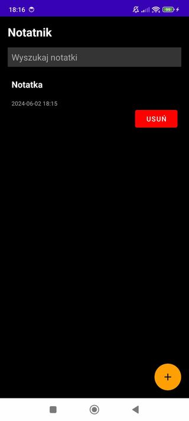

# Dokumentacja aplikacji NoteEncryptor
## Wprowadzenie
NoteEncryptor to aplikacja do robienia notatek, zaprojektowana, aby uporządkować i chronić notatki. Dzięki NoteEncryptor możesz tworzyć zarówno notatki tekstowe, jak i głosowe, każda z opcją dodania hasła w celu zwiększenia bezpieczeństwa.

## Layout Aplikacji
### activity_add_note.xml

Ten plik XML definiuje interfejs użytkownika dla aktywności AddNoteActivity w aplikacji. Zawiera układ RelativeLayout z trzema polami tekstowymi do wprowadzania tytułu notatki, opisu i hasła oraz przyciskiem do zapisania notatki.

### activity_main.xml

Ten plik XML definiuje interfejs użytkownika dla aktywności MainActivity w aplikacji. Układ RelativeLayout zawiera:
- Tekstowy widok (TextView) do wyświetlania tytułu aplikacji.
- Pole tekstowe (EditText) do wyszukiwania notatek.
- Widok RecyclerView do wyświetlania listy notatek.
- Przycisk akcji (FloatingActionButton) do dodawania nowych notatek.

### activity_voice_note.xml

Ten plik XML definiuje interfejs użytkownika dla aktywności VoiceNoteActivity w aplikacji. Zawiera on pojedynczy przycisk, który służy do rozpoczęcia nagrywania notatki głosowej. Przycisk jest wyśrodkowany na ekranie, a jego tekst jest ustawiony na wartość zdefiniowaną w pliku zasobów jako voice_note.

### item_note.xml

Ten plik XML definiuje pojedynczy element widoku w interfejsie użytkownika, który jest używany w adapterze listy notatek. Jest to układ LinearLayout o orientacji pionowej, który zawiera następujące elementy:

- TextView (noteTitle): Wyświetla tytuł notatki. Ma pogrubioną czcionkę i biały kolor tekstu.

- TextView (noteDescription): Wyświetla opis notatki. Ma szary kolor tekstu.

- TextView (noteTimestamp): Wyświetla znacznik czasu notatki. Ma mniejszą czcionkę i szary kolor tekstu.

- Button (deleteButton): Przycisk do usuwania notatki. Jest wyśrodkowany do prawego górnego rogu i ma czerwoną ikonę usuwania oraz biały tekst. Przycisk ma tło czerwonego koloru.

## Logika biznesowa aplikacji
### AddNoteActivity.kt
Plik AddNoteActivity definiuje klasę AddNoteActivity, która jest odpowiedzialna za dodawanie i edytowanie notatek. Zawiera ona metody do inicjalizacji interfejsu użytkownika, obsługi zapisywania notatek oraz haszowania hasła. 
- Metoda onCreate jest wywoływana przy tworzeniu aktywności. Odpowiada za ustawienie layoutu aktywności. Pobiera referencje do pól tekstowych (titleEditText, descriptionEditText, passwordEditText) oraz przycisku zapisu (saveButton). Odczytuje dane notatki przekazane w intencji (noteId, title, description, password) i ustawia te dane w odpowiednich polach tekstowych. Ustawia OnClickListener na przycisku zapisu, aby obsłużyć zapisanie notatki po kliknięciu.
  
- Metoda anonimowa saveButton.setOnClickListener pobiera aktualne wartości z pól tekstowych, generuje aktualny znacznik czasu (timestamp), haszuje hasło, jeśli zostało podane, tworzy intencję z danymi notatki (noteId, title, description, timestamp, passwordHash), ustawia wynik aktywności na RESULT_OK i kończy aktywność, wracając do poprzedniego ekranu.
  
- Metoda hashPassword tworzy obiekt MessageDigest dla algorytmu SHA-256, haszuje podane hasło i konwertuje wynik na ciąg szesnastkowy.

Inne elementy:

- noteId jest identyfikatorem notatki, który jest przekazywany w intencji. title, description, password to pola tekstowe, które przechowują odpowiednie dane notatki. timestamp to aktualny znacznik czasu używany do oznaczenia momentu zapisania notatki. passwordHash to haszowane hasło, używane do zabezpieczenia notatki.

### MainActivity.kt
Klasa MainActivity jest odpowiedzialna za wyświetlanie listy notatek, zarządzanie nimi oraz umożliwienie ich edycji lub dodawania nowych. Zawiera metody do inicjalizacji interfejsu użytkownika, filtrowania notatek, obsługi dodawania i edytowania notatek, a także sprawdzania hasła przed edycją.

- Metoda onCreate jest wywoływana przy tworzeniu aktywności. Odpowiada za ustawienie layoutu aktywności na activity_main. Inicjalizuje RecyclerView, ustawia jego layout manager na LinearLayoutManager, pobiera notatki z PreferenceHelper i dodaje je do listy notes oraz filteredNotes. Inicjalizuje adapter NoteAdapter z odpowiednimi funkcjami usuwania i edytowania notatek, a następnie przypisuje go do RecyclerView. Pobiera referencje do pola wyszukiwania (searchEditText) i dodaje do niego TextWatcher, który filtruje notatki podczas wpisywania tekstu. Ustawia OnClickListener na przycisku dodawania notatki (fab), który wyświetla dialog wyboru typu notatki.

- Metoda showNoteTypeDialog wyświetla dialog wyboru typu notatki. Umożliwia użytkownikowi wybór między dodaniem notatki tekstowej a notatki głosowej. Na podstawie wyboru użytkownika, uruchamia odpowiednią aktywność (AddNoteActivity lub VoiceNoteActivity).

- Metoda filterNotes filtruje listę notatek na podstawie wprowadzonego tekstu w polu wyszukiwania. Tworzy listę filteredNotes zawierającą tylko te notatki, których tytuły zawierają podany tekst, i aktualizuje adapter RecyclerView.

- Metoda deleteNote usuwa podaną notatkę z listy notes i zapisuje zaktualizowaną listę notatek za pomocą PreferenceHelper. Następnie filtruje notatki, aby zaktualizować widok.

- Metoda editNoteWithPasswordCheck sprawdza, czy notatka jest chroniona hasłem. Jeśli tak, wyświetla dialog wprowadzenia hasła. Po wprowadzeniu hasła, sprawdza jego zgodność z zapisanym hashem. Jeśli hasło jest poprawne, uruchamia edycję notatki. Jeśli notatka nie jest chroniona hasłem, uruchamia edycję bez sprawdzania hasła.

- Metoda hashPassword tworzy obiekt MessageDigest dla algorytmu SHA-256, haszuje podane hasło i konwertuje wynik na ciąg szesnastkowy.

- Metoda editNote uruchamia AddNoteActivity w trybie edycji, przekazując dane notatki, takie jak noteId, title, description, passwordHash oraz opcjonalnie hasło.

- Metoda onActivityResult obsługuje wyniki zwracane z aktywności dodawania i edytowania notatek. Jeśli wynik jest RESULT_OK, pobiera dane notatki z intencji i aktualizuje listę notes oraz filteredNotes w zależności od kodu żądania (dodanie nowej notatki, edycja istniejącej notatki, dodanie notatki głosowej). Zapisuje zaktualizowaną listę notatek za pomocą PreferenceHelper.

- Metoda addNoteToTop dodaje nową notatkę na początku listy notes i filteredNotes, aktualizuje adapter RecyclerView, przewija listę na górę oraz zapisuje zaktualizowaną listę notatek za pomocą PreferenceHelper.

### Note.kt
Klasa Note jest odpowiedzialna za przechowywanie danych notatek. Jest to prosta klasa danych, która definiuje strukturę notatki, zawierając takie informacje jak identyfikator, tytuł, opis, znacznik czasu oraz opcjonalnie hasz hasła.

Pola klasy Note:

- id: Pole, które przechowuje unikalny identyfikator notatki. Domyślna wartość to 0.

- title: Zmienna typu String, przechowująca tytuł notatki.

- description: Zmienna typu String, przechowująca opis notatki.

- timestamp: Pole, które przechowuje znacznik czasu utworzenia lub modyfikacji notatki.

- passwordHash: Opcjonalna zmienna typu String, która przechowuje hasz hasła, jeśli notatka jest chroniona hasłem. Domyślna wartość to null.

### NoteAdapter.kt
Klasa NoteAdapter jest odpowiedzialna za zarządzanie wyświetlaniem listy notatek w RecyclerView. Adapter ten obsługuje wyświetlanie tytułu, opisu i znacznika czasu notatek, a także zapewnia funkcjonalność edycji i usuwania notatek. 

- Konstruktor klasy NoteAdapter przyjmuje trzy parametry: listę notatek (notes), funkcję obsługującą kliknięcia przycisku usuwania (onDeleteClick) oraz funkcję obsługującą kliknięcia elementu listy w celu edycji (onEditClick). Inicjalizuje pola klasy tymi wartościami.

Klasa NoteViewHolder dziedziczy po RecyclerView.ViewHolder i reprezentuje pojedynczy widok elementu notatki w RecyclerView. Zawiera referencje do widżetów w widoku notatki:

- titleTextView: TextView wyświetlający tytuł notatki.

- descriptionTextView: TextView wyświetlający opis notatki.

- timestampTextView: TextView wyświetlający znacznik czasu notatki.

- deleteButton: Button służący do usuwania notatki.

- Metoda onCreateViewHolder tworzy nowy widok elementu notatki. Inflatuje layout item_note i zwraca nowy obiekt NoteViewHolder, który przechowuje referencje do widżetów w inflatowanym widoku.

- Metoda onBindViewHolder wiąże dane notatki z widokiem NoteViewHolder w określonej pozycji. Ustawia tekst tytułu, opisu i znacznika czasu notatki w odpowiednich widżetach. Ustawia OnClickListener dla przycisku usuwania oraz dla całego elementu widoku, aby obsłużyć odpowiednio usuwanie i edytowanie notatki.

- Metoda getItemCount zwraca liczbę elementów w liście notatek (notes).

- Metoda removeItem usuwa notatkę z listy notes i powiadamia adapter RecyclerView o usunięciu elementu na odpowiedniej pozycji. Znajduje pozycję notatki w liście i, jeśli istnieje, usuwa ją oraz wywołuje notifyItemRemoved.

- Metoda updateNote aktualizuje notatkę w liście notes i powiadamia adapter RecyclerView o zmianie elementu na odpowiedniej pozycji. Znajduje indeks notatki o danym identyfikatorze (id) i, jeśli istnieje, zastępuje ją nową wersją notatki oraz wywołuje notifyItemChanged.

- Metoda getNoteById zwraca notatkę z listy notes na podstawie podanego identyfikatora (id). Przeszukuje listę i zwraca notatkę, jeśli taka istnieje.

### PreferenceHelper.kt
Obiekt PreferenceHelper jest odpowiedzialny za zarządzanie przechowywaniem i pobieraniem notatek z preferencji aplikacji. Wykorzystuje SharedPreferences do zapisywania i odczytywania danych notatek w formacie JSON przy użyciu biblioteki Gson.

Obiekt PreferenceHelper definiuje dwie stałe:

- PREFS_NAME: Nazwa pliku preferencji (notes_prefs).

- NOTES_KEY: Klucz używany do przechowywania notatek w preferencjach (notes).

- Metoda getNotes pobiera notatki z preferencji aplikacji. Na początku uzyskuje instancję SharedPreferences za pomocą kontekstu aplikacji. Następnie pobiera ciąg JSON notatek z preferencji za pomocą klucza NOTES_KEY. Jeśli ciąg JSON jest null, metoda zwraca pustą listę. W przeciwnym razie, ciąg JSON jest konwertowany na listę obiektów Note przy użyciu Gson i metoda zwraca tę listę.

- Metoda saveNotes zapisuje notatki do preferencji aplikacji. Najpierw uzyskuje instancję SharedPreferences za pomocą kontekstu aplikacji, a następnie tworzy edytor SharedPreferences do edytowania preferencji. Następnie konwertuje listę obiektów Note na ciąg JSON przy użyciu Gson i zapisuje ten ciąg JSON do preferencji pod kluczem NOTES_KEY. Na końcu, metoda stosuje zmiany przy użyciu metody apply edytora.

### VoiceNoteActivity.kt
Klasa VoiceNoteActivity jest odpowiedzialna za nagrywanie notatek głosowych i konwertowanie ich na tekst przy użyciu rozpoznawania mowy.

- Metoda onCreate jest wywoływana podczas tworzenia aktywności. Ustawia widok aktywności na layout activity_voice_note. Inicjuje przycisk recordButton i ustawia dla niego listener kliknięcia. Kiedy przycisk jest kliknięty, sprawdzane jest, czy aplikacja ma uprawnienia do nagrywania audio. Jeśli uprawnienia są przyznane, wywoływana jest metoda startVoiceInput, w przeciwnym razie wywoływana jest metoda requestPermission.

- Metoda checkPermission sprawdza, czy aplikacja ma uprawnienia do nagrywania audio. Zwraca true, jeśli uprawnienia są przyznane, lub false, jeśli nie są.

- Metoda requestPermission żąda od użytkownika przyznania aplikacji uprawnień do nagrywania audio. Używa do tego klasy ActivityCompat, wywołując metodę requestPermissions z odpowiednim kodem żądania.

- Metoda startVoiceInput inicjuje intencję RecognizerIntent.ACTION_RECOGNIZE_SPEECH, aby rozpocząć wprowadzanie głosowe. Ustawia model języka na RecognizerIntent.LANGUAGE_MODEL_FREE_FORM, język na domyślny dla urządzenia i wyświetla prompt z napisem "Speak your note". Próbuje uruchomić aktywność rozpoznawania mowy, a w przypadku braku wsparcia dla wprowadzania mowy na urządzeniu, wyświetla komunikat Toast z informacją o braku wsparcia.

- Metoda onActivityResult jest wywoływana po zakończeniu aktywności rozpoznawania mowy. Sprawdza, czy kod żądania jest równy REQUEST_SPEECH_INPUT i czy wynik jest Activity.RESULT_OK. Jeśli oba warunki są spełnione, pobiera wynik rozpoznawania mowy jako listę String i zapisuje pierwszy element jako opis notatki. Tworzy nową intencję, do której dodaje tytuł, opis i znacznik czasowy notatki. Ustawia wynik na Activity.RESULT_OK i kończy aktywność.

- Metoda onRequestPermissionsResult jest wywoływana po zakończeniu żądania uprawnień. Sprawdza, czy kod żądania jest równy REQUEST_RECORD_AUDIO_PERMISSION i czy wynik jest pozytywny. Jeśli uprawnienia zostały przyznane, wywoływana jest metoda startVoiceInput. Jeśli uprawnienia nie zostały przyznane, wyświetla komunikat Toast z informacją o odmowie uprawnień.
